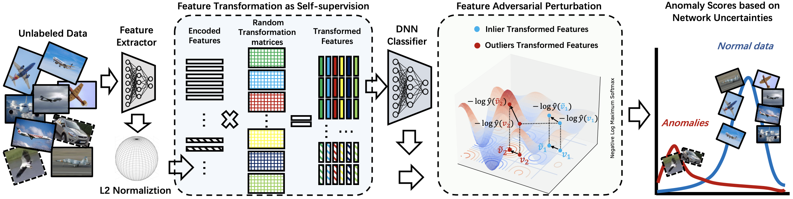

# SLA$^2$P: Self-supervised Anomaly Detection with Adversarial Perturbation （CIKM 2022）

    
    
    

[arXiv](https://arxiv.org/abs/2111.12896) | Primary contact: [Yizhou Wang](mailto:wyzjack990122@gmail.com)

  

## Abstract

We propose a novel and powerful framework, dubbed as SLA$^2$P, for unsupervised anomaly detection. After extracting representative embeddings from raw data, we apply random projections to the features and regard features transformed by different projections as belonging to distinct pseudo-classes. We then train a classifier network on these transformed features to perform self-supervised learning. Next, we add adversarial perturbation to the transformed features to decrease their softmax scores of the predicted labels and design anomaly scores based on the predictive uncertainties of the classifier on these perturbed features. Our motivation is that because of the relatively small number and the decentralized modes of anomalies, **1)** the pseudo label classifier's training concentrates more on learning the semantic information of normal data rather than anomalous data; **2)** the transformed features of the normal data are more robust to the perturbations than those of the anomalies. Consequently, the perturbed transformed features of anomalies fail to be classified well and accordingly have lower anomaly scores than those of the normal samples. Extensive experiments on image, text, and inherently tabular benchmark datasets back up our findings and indicate that SLA$^2$P achieves state-of-the-art anomaly detection performance consistently. Specifically, in the AUPR score metric, our SLA$^2$P achieves up to **13\%** improvement on images, **22\%** improvement on texts, and **42\%** improvement on inherently tabular datasets over current SOTA methods.

## TODO
Code will be released soon! Stay tuned!

## BibTeX

    @article{wang2021sla,
        title={SLA $\^{} 2$ P: Self-supervised Anomaly Detection with Adversarial Perturbation},
        author={Wang, Yizhou and Qin, Can and Wei, Rongzhe and Xu, Yi and Bai, Yue and Fu, Yun},
        journal={arXiv preprint arXiv:2111.12896},
        year={2021}
    }
