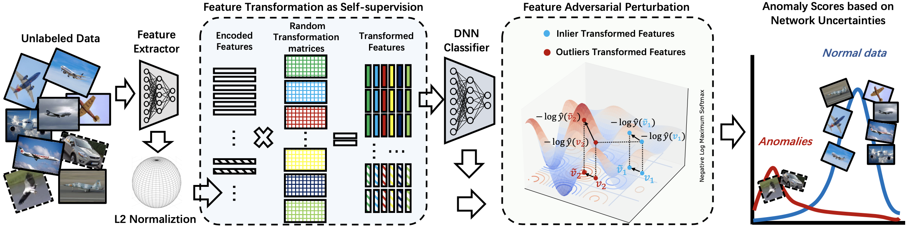

# SLA²P: Self-supervised Anomaly Detection with Adversarial Perturbation (TKDE 2024).


<div align="left">
    <a></a>
    <a></a>
    <a></a>
</div>

 [PDF](https://ieeexplore.ieee.org/stamp/stamp.jsp?tp=&arnumber=10645289) | Primary contact: [Yizhou Wang](mailto:wyzjack990122@gmail.com)

<div align="center">
  
</div>

## Short version: Self-supervision Meets Adversarial Perturbation: A Novel Framework for Anomaly Detection （CIKM 2022）[[paper](https://dl.acm.org/doi/pdf/10.1145/3511808.3557697)][[code branch](https://github.com/wyzjack/SLA2P/tree/CIKM-2022)]


## Abstract

Anomaly detection is a foundational yet difficult problem in machine learning. In this work, we propose a new and effective framework, dubbed as SLA$^2$P, for unsupervised anomaly detection. Following the extraction of delegate embeddings from raw data, we implement random projections on the features and consider features transformed by disparate projections as being associated with separate pseudo-classes. We then train a neural network for classification on these transformed features to conduct self-supervised learning. Subsequently, we introduce adversarial disturbances to the modified attributes, and we develop anomaly scores built on the classifier's predictive uncertainties concerning these disrupted features. Our approach is motivated by the fact that as anomalies are relatively rare and decentralized, **1)** the training of the pseudo-label classifier concentrates more on acquiring the semantic knowledge of regular data instead of anomalous data; **2)** the altered attributes of the normal data exhibit greater resilience to disturbances compared to those of the anomalous data. Therefore, the disrupted modified attributes of anomalies can not be well classified and correspondingly tend to attain lesser anomaly scores. The results of experiments on various benchmark datasets for images, text, and inherently tabular data demonstrate that SLA$^2$P achieves state-of-the-art performance consistently.


## Usage

#### Environment setup

```bash
conda env create -f env.yaml
```


#### Prepare data

Download processed data (Caltech 101, 20 Newsgroups and Reuters) from [[Google Drive Link]](https://drive.google.com/drive/folders/11Bvi9x3dfDql5tov4NmEgVtLGQRFKPSy?usp=sharing) and put them into folder `/data`. They are borrowed from the [[official implementation of RSRAE]](https://github.com/dmzou/RSRAE) (Robust Subspace Recovery Layer for Unsupervised Anomaly Detection. ICLR 2020)

To prepare BERT embeddings for 20 Newsgroups dataset, you can run

```bash
python extract_bert_embeddings_20news.py
```
the processed embeddings will be saved in `20news_bert.data`. We also provide the processed embeddings [here](https://www.dropbox.com/scl/fi/rjp1dbi9t86wkfymtng7l/20news_bert.data?rlkey=jcioavl7sv17tl9ti9ffdgg6o&st=a5dtkcnu&dl=0).

To prepare BERT embeddings for , you can run

```bash
python extract_bert_embeddings_arrhythmia.py
```
the processed embeddings will be saved in `arrhythmia_bert.mat`. We also provide the processed embeddings [here](https://www.dropbox.com/scl/fi/2s7xpibdaorymz7a2ahtl/arrhythmia_bert.mat?rlkey=3psikp8e7yxaf8yvwjqd4j4he&st=6r849j1i&dl=0).

To prepapre GPT embeddings, you first need to set your "Open"AI API key in environment variable `OPENAI_API_KEY` via `export OPENAI_API_KEY=your_api_key`. Then run

```bash
python extract_GPT3_embedding_20news.py
python extract_GPT3_embedding_arrhythmia.py
```
the corresponding processed embeddings will be saved in `20news_gpt3.data` and `arrhythmia_gpt3.mat`. We also provide the processed embeddings at [20news_gpt3](https://www.dropbox.com/scl/fi/ug5krmptumot49bzgl05f/20news_gpt3.data?rlkey=ytt7x5zmqwsyo3psazi46f8yz&st=9xsqhj1v&dl=0) and [arrhythmia_gpt3](https://www.dropbox.com/scl/fi/km4dh9reg7ng6juk25afq/arrhythmia_gpt3.mat?rlkey=0d69jmh7kfxjcd2xhd5moghlr&st=34t4b2bj&dl=0).


#### Run the experiments

The SLA$^2$P method is implemented in `sla2p.py` and the SLA (w/o adversarial perturbation) method is in `sla.py`. 

To reproduce the results reported in the main paper, run the following commands.

```bash
# CIFAR-10
python sla2p.py --dataset cifar10 --n_rots 256 --d_out 256 --acc_thres 0.6 --epsilon 1000

# CIFAR-100
python sla2p.py --dataset cifar100 --n_rots 256 --d_out 256 --acc_thres 0.6 --epsilon 10000

# Caltech 101
python sla2p.py --dataset caltech --n_rots 256 --d_out 256 --acc_thres 0.6 --epsilon 1000

# 20 Newsgroups
python sla2p.py --dataset 20news --n_rots 256 --d_out 256 --acc_thres 0.75 --epsilon 10

# Reuters
python sla2p.py --dataset reuters --n_rots 512 --d_out 128 --acc_thres 0.3 --epsilon 100

# Arrhythmia
python sla2p.py --dataset arrhythmia --n_rots 256 --d_out 256 --acc_thres 0.6 --epsilon 1000

# KDD
python sla2p.py --dataset kdd --n_rots 64 --d_out 128 --acc_thres 0.6 --epsilon 1000

# 20 Newsgroups (BERT)
python sla2p.py --dataset 20news_bert --n_rots 256 --d_out 256 --acc_thres 0.6 --epsilon 1000

# 20 Newsgroups (GPT3)
python sla2p.py --dataset 20news_gpt3 --n_rots 256 --d_out 256 --acc_thres 0.6 --epsilon 1000 --gpt3

# Arrhythmia (BERT)
python sla2p.py --dataset arrhythmia_bert --n_rots 256 --d_out 256 --acc_thres 0.6 --epsilon 1000 --bert

# Arrhythmia (GPT3)
python sla2p.py --dataset arrhythmia_gpt3 --n_rots 256 --d_out 256 --acc_thres 0.6 --epsilon 1000 --gpt3

``` 

To evalute Unsupervised Anomaly Detection performance, use `evaluate_roc_auc.py` for AUROC scores and `evaluate_pr_auc.py` for AUPR scores.


## Acknowledgments
In this code we heavily rely on the [code of E3Outlier](https://github.com/demonzyj56/E3Outlier). The README file format is heavily based on the GitHub repos of my senior colleague [Huan Wang](https://github.com/MingSun-Tse) and [Xu Ma](https://github.com/ma-xu). Great thanks to them! We also greatly thank the anounymous TKDE and CIKM'22 reviewers for the constructive comments to help us improve the paper. 


## BibTeX

```BibTeX
@ARTICLE{10645289,
  author={Wang, Yizhou and Qin, Can and Wei, Rongzhe and Xu, Yi and Bai, Yue and Fu, Yun},
  journal={IEEE Transactions on Knowledge and Data Engineering}, 
  title={SLA$^{{\text{2}}}$2P: Self-Supervised Anomaly Detection With Adversarial Perturbation}, 
  year={2024},
  volume={36},
  number={12},
  pages={9282-9293},
  keywords={Feature extraction;Anomaly detection;Perturbation methods;Task analysis;Training;Uncertainty;Unsupervised learning;Data mining- anomaly detection;machine learning- deep learning;representation learning},
  doi={10.1109/TKDE.2024.3448473}
}

@inproceedings{wang2022self,
  title={Self-supervision Meets Adversarial Perturbation: A Novel Framework for Anomaly Detection},
  author={Wang, Yizhou and Qin, Can and Wei, Rongzhe and Xu, Yi and Bai, Yue and Fu, Yun},
  booktitle={Proceedings of the 31st ACM International Conference on Information \& Knowledge Management},
  pages={4555--4559},
  year={2022}
}
```
